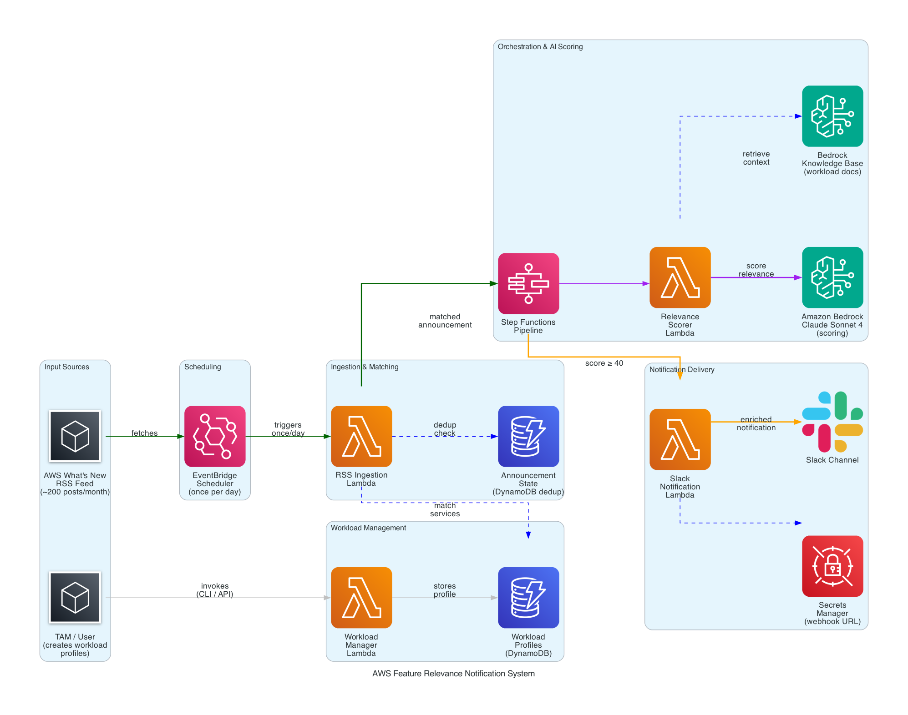
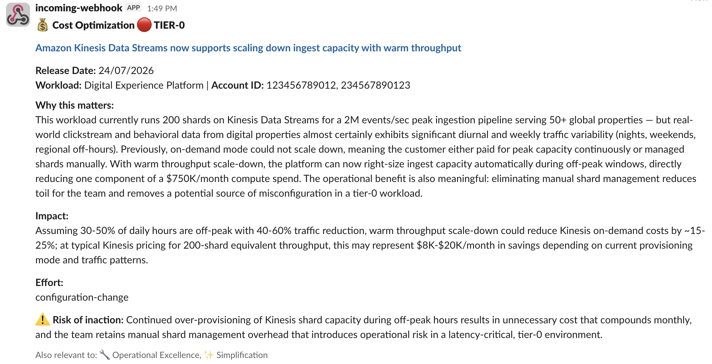
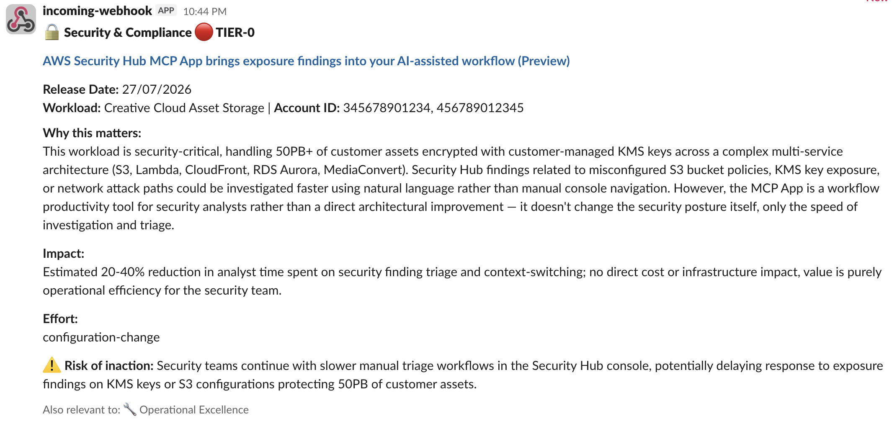

# AWS Feature Relevance Notification System
*Automatically score and deliver curated AWS feature announcements to the teams that need them using Amazon Bedrock*

## Overview

AWS publishes 200+ feature announcements every month. For enterprise customers operating across dozens of accounts and hundreds of services, identifying which announcements matter to which workload is a manual, time-consuming process. This system solves that by automatically ingesting AWS "What's New" announcements, scoring their relevance against workload profiles using Amazon Bedrock (Claude Sonnet 4), and delivering enriched Slack notifications with benefit categorization, impact estimates, and adoption guidance.

## At a Glance

- **Duration**: 20 minutes
- **Difficulty**: Intermediate
- **Target Audience**: Cloud Engineers, Solutions Architects, Platform Teams
- **Key Technologies**: Amazon Bedrock, AWS Step Functions, AWS Lambda, Amazon DynamoDB, Amazon EventBridge, AWS Secrets Manager
- **Estimated Cost**: $10-$200/month depending on number of workload profiles (see Cost Estimate below)

## Business Value

- Transforms 200+ monthly announcements into 8-15 curated, actionable recommendations per workload
- Zero manual effort after initial setup
- Multi-category AI scoring across 8 benefit dimensions (not just cost)
- Workload-specific analysis grounded in actual architecture and scale
- Tier-0 prioritization for mission-critical workloads

## What You'll See

1. Deploy the infrastructure (CDK stack with Lambda, Step Functions, DynamoDB, EventBridge)
2. Register workload profiles with services, architecture descriptions, and Slack channels
3. System polls AWS What's New RSS feed daily
4. Matched announcements are scored by Claude Sonnet 4 across 8 benefit categories
5. High-relevance announcements trigger rich Slack notifications with impact analysis

## Architecture



### Pipeline Flow

```
EventBridge (daily) → RSS Lambda → DynamoDB (dedup) → Step Functions
                                                            │
                                        ┌───────────────────┤
                                        ▼                   ▼
                                 Bedrock KB Retrieve   Free-text Profile
                                 (filtered by           (from DynamoDB)
                                  workload_id)
                                        │                   │
                                        └─────────┬─────────┘
                                                  ▼
                                        Claude Sonnet 4 Scoring
                                        (relevance + category + impact)
                                                  │
                                            Score ≥ 40?
                                            /        \
                                          Yes         No → Skip
                                           │
                                           ▼
                                  Slack Notification
                                  (enriched Block Kit message)
```

### Benefit Categories

| Category | Tag | What It Captures |
|----------|-----|-----------------|
| Cost Optimization | 💰 | Reduces spend, better pricing, savings plans |
| Performance | ⚡ | Lower latency, higher throughput, capacity |
| Security & Compliance | 🔒 | New controls, compliance, encryption |
| Operational Excellence | 🔧 | Simplifies management, observability |
| Reliability | 🛡️ | Higher availability, better DR |
| Technical Debt Reduction | 🧹 | Deprecation replacements, modernization |
| Simplification | ✨ | Replaces complex workarounds |
| New Capability | 🚀 | Unlocks previously impossible patterns |

---

## Prerequisites

- AWS CLI configured with appropriate credentials
- AWS CDK CLI installed (`npm install -g aws-cdk`)
- Python 3.9+
- Node.js 18+ (for CDK)
- An AWS account with Bedrock model access enabled (Claude Sonnet 4)
- A Slack workspace with an Incoming Webhook configured

---

## Deployment

### Step 1: Deploy Infrastructure

```bash
./deploy-all.sh
```

Or on Windows:
```powershell
.\deploy-all.ps1
```

The deploy script will:
- Install CDK dependencies
- Set `PYTHONPATH` for shared utilities
- Run `cdk deploy` with your configured region
- Output stack resource names

### Step 2: Configure Slack Webhook

Update the Secrets Manager secret with your actual webhook URL:

```bash
STACK_NAME="FeatureRelevanceNotification-$(aws configure get region)"
SECRET_ARN=$(aws cloudformation describe-stacks --stack-name "$STACK_NAME" \
  --query "Stacks[0].Outputs[?OutputKey=='SlackSecretArn'].OutputValue" --output text)

aws secretsmanager put-secret-value \
  --secret-id "$SECRET_ARN" \
  --secret-string '{"webhook_url":"https://hooks.slack.com/services/YOUR/WEBHOOK/URL"}'
```

### Step 3: Create Workload Profiles

```bash
WORKLOAD_MANAGER=$(aws cloudformation describe-stacks --stack-name "$STACK_NAME" \
  --query "Stacks[0].Outputs[?OutputKey=='WorkloadManagerFunctionName'].OutputValue" --output text)

aws lambda invoke --function-name "$WORKLOAD_MANAGER" \
  --cli-binary-format raw-in-base64-out \
  --payload '{
    "action": "create",
    "profile": {
      "workload_id": "my-workload-001",
      "workload_name": "My Production Workload",
      "account_ids": ["123456789012"],
      "pod_slack_channel": "#my-channel",
      "workload_tier": "tier-0",
      "free_text_description": "Describe your workload architecture here.",
      "key_services": ["Amazon EKS", "Amazon DynamoDB", "Amazon S3"]
    }
  }' /tmp/output.json
```

**Key fields:**

| Field | Purpose |
|-------|---------|
| `workload_id` | Unique identifier (also used for KB metadata filtering) |
| `key_services` | AWS services for keyword matching against announcements |
| `free_text_description` | Rich architecture context for Claude scoring |
| `workload_tier` | `tier-0` (threshold ≥25) or `standard` (threshold ≥40) |
| `pod_slack_channel` | Slack channel for notification routing |

### Step 4: Test

```bash
RSS_FUNCTION=$(aws cloudformation describe-stacks --stack-name "$STACK_NAME" \
  --query "Stacks[0].Outputs[?OutputKey=='RSSIngestionFunctionName'].OutputValue" --output text)

aws lambda invoke --function-name "$RSS_FUNCTION" \
  --cli-binary-format raw-in-base64-out \
  --payload '{"test_mode": true}' /tmp/test.json && cat /tmp/test.json
```

---

## Slack Notification Examples





---

## Knowledge Base Setup (Optional)

For deeper scoring using architecture documents:

1. Create an S3 bucket and upload documents with metadata:
```bash
aws s3 sync kb-documents/ s3://your-kb-bucket-name/
```

Each document needs a companion `.metadata.json`:
```json
{
  "metadataAttributes": {
    "workload_id": "your-workload-id",
    "document_type": "architecture"
  }
}
```

2. Create a Bedrock Knowledge Base via the console (requires OpenSearch Serverless)

3. Pass the Knowledge Base ID during deployment:
```bash
./deploy-all.sh --knowledge-base-id YOUR_KB_ID
```

---

## Project Structure

```
aws-feature-relevance-notification-system/
├── README.md
├── ARCHITECTURE.md
├── deploy-all.ps1
├── deploy-all.sh
├── architecture.png
├── infrastructure/
│   └── cdk/
│       ├── app.py                     # CDK app with tracking
│       ├── cdk.json
│       ├── requirements.txt
│       └── lib/
│           └── feature_relevance_stack.py
├── lambdas/
│   ├── rss-ingestion/index.py
│   ├── relevance-scorer/index.py
│   ├── slack-notification/index.py
│   └── workload-manager/index.py
├── step-functions/
│   └── state-machine.json
├── sample-data/
│   ├── workload-dxp.json
│   └── workload-creative-cloud.json
└── kb-documents/
    ├── dxp-001/
    └── cc-001/
```

---

## Estimated Cost Breakdown

| Component | Pricing Model | Monthly Cost |
|-----------|---------------|--------------|
| Amazon Bedrock (Claude Sonnet 4) | Per-token, ~5-100 calls/day | $10-$200 |
| AWS Lambda (4 functions) | Pay-per-invocation | < $1 |
| Amazon DynamoDB (2 tables) | PAY_PER_REQUEST | < $1 |
| AWS Step Functions | Standard workflow | < $1 |
| Amazon EventBridge | Free tier | $0 |
| AWS KMS | 1 key + API calls | < $5 |
| AWS Secrets Manager | 1 secret | < $1 |

**Total**: $10-$200/month (Bedrock accounts for 90-95% of cost)

**Demo cost** (one-time testing): < $5
**Production cost** (20 workloads): ~$100-$200/month

---

## Configuration

| Setting | How to Change |
|---------|---------------|
| Polling frequency | Modify EventBridge schedule in CDK stack |
| Relevance threshold | Adjust Choice state in Step Functions (default: 40 standard, 25 tier-0) |
| Service keywords | Edit `SERVICE_KEYWORDS` in `lambdas/rss-ingestion/index.py` |
| Bedrock model | Pass `--context bedrock_model_id=MODEL_ID` to `cdk deploy` |

---

## Cleanup

```bash
./deploy-all.sh --destroy-infra
```

Or manually:
```bash
REGION=$(aws configure get region)
cdk destroy "FeatureRelevanceNotification-$REGION" --force
```

---

## Contributing

We welcome community contributions! Please see [CONTRIBUTING.md](../../CONTRIBUTING.md) for guidelines.

## Security

See [CONTRIBUTING](../../CONTRIBUTING.md#security-issue-notifications) for more information.

## License

This library is licensed under the MIT-0 License. See the [LICENSE](../../LICENSE) file.
